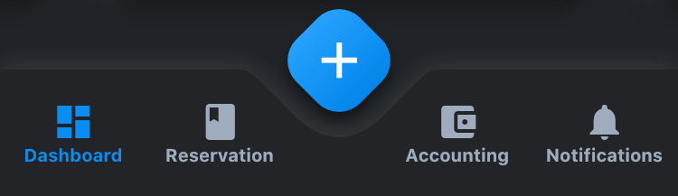
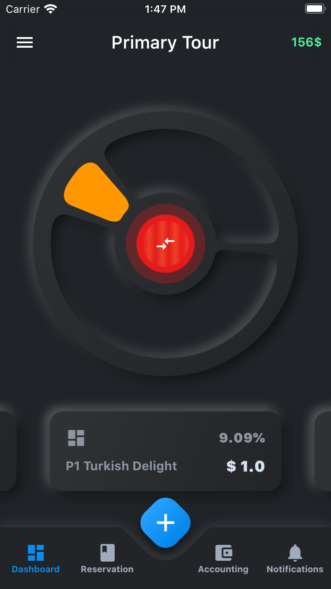

 


# PandaBar

A fancy bottom navigation bar for pandas. Pandabar designed for new neumorphic design trend.

| Preview | PageView |
|---------|----------|
| |  |

### PandaBar
- `buttonData` - navigation items, required more than one item and less than 5
- `onChange` - required to listen when a item is pressed it provide the selected item's id
- `backgroundColor` - the navigation bar's background color
- `fabIcon` - the navigation bar's fab button icon
- `onFabButtonPressed` - required to listen fab button is pressed

### PandaBarButtonData
- `id` - the id of this item
- `icon` - the icon of this item
- `title` - the title of this item

## Getting Started

Add the dependency in `pubspec.yaml`:

```yaml
dependencies:
  ...
  pandabar: ^0.0.6
```

## Basic Usage

Adding the widget

```dart
bottomNavigationBar: PandaBar(
  buttonData: [
    PandaBarButtonData(
      id: AppPage.Dashboard,
      icon: Icons.dashboard,
      title: 'Dashboard'
    ),
    PandaBarButtonData(
      id: AppPage.ReservationList,
      icon: Icons.book,
      title: 'Reservation'
    ),
    PandaBarButtonData(
      id: AppPage.Accounting,
      icon: Icons.account_balance_wallet,
      title: 'Accounting'
    ),
    PandaBarButtonData(
      id: AppPage.Notifications,
      icon: Icons.notifications,
      title: 'Notifications'
    ),
  ],
  onChange: (id) {
    BlocProvider.of<DrawerBloc>(context).add(PageSelected(page: (id as AppPage)));
  },
  onFabButtonPressed: () {
    Navigator.push(context, CupertinoPageRoute(
      fullscreenDialog: true,
      builder: (context) => NewBookingScreen(),
    ));
  },
),
```
