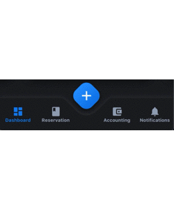
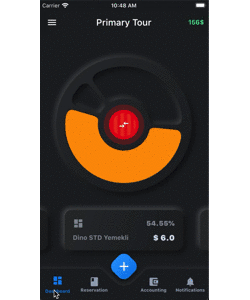

 


# PandaBar

A fancy bottom navigation bar for pandas. Pandabar designed for new neumorphic design trend.

| Preview | PageView |
|---------|----------|
| |  |

### PandaBar
- `buttonColor` - to change button color
- `buttonSelectedColor` - to change button selected color
- `backgroundColor` - the navigation bar's background color
- `buttonData` - navigation items, required more than one item and less than 5
- `fabIcon` - the navigation bar's fab button icon
- `fabColors` - the navigation bar's fab button gradient colors
- `onFabButtonPressed` - required to listen fab button is pressed
- `onChange` - required to listen when a item is pressed it provide the selected item's id

### PandaBarButtonData
- `id` - the id of this item
- `icon` - the icon of this item
- `title` - the title of this item

## Getting Started

Add the dependency in `pubspec.yaml`:

```yaml
dependencies:
  ...
  pandabar: ^0.1.1
```

## Basic Usage

```dart
class HomePage extends StatefulWidget {
  @override
  _HomePageState createState() => _HomePageState();
}

class _HomePageState extends State<HomePage> {

  String page = 'Grey';

  @override
  Widget build(BuildContext context) {
    return Scaffold(
      extendBody: true,
      bottomNavigationBar: PandaBar(
        buttonData: [
          PandaBarButtonData(
            id: 'Grey',
            icon: Icons.dashboard,
            title: 'Grey'
          ),
          PandaBarButtonData(
            id: 'Blue',
            icon: Icons.book,
            title: 'Blue'
          ),
          PandaBarButtonData(
            id: 'Red',
            icon: Icons.account_balance_wallet,
            title: 'Red'
          ),
          PandaBarButtonData(
            id: 'Yellow',
            icon: Icons.notifications,
            title: 'Yellow'
          ),
        ],
        onChange: (id) {
          setState(() {
            page = id;
          });
        },
        onFabButtonPressed: () {

        },
      ),
      body: Builder(
        builder: (context) {

          switch (page) {
            case 'Grey':
              return Container(color: Colors.grey.shade900);
            case 'Blue':
              return Container(color: Colors.blue.shade900);
            case 'Red':
              return Container(color: Colors.red.shade900);
            case 'Yellow':
              return Container(color: Colors.yellow.shade700);
            default:
              return Container();
              
          }

        },
      ),
    );
  }
}
```
